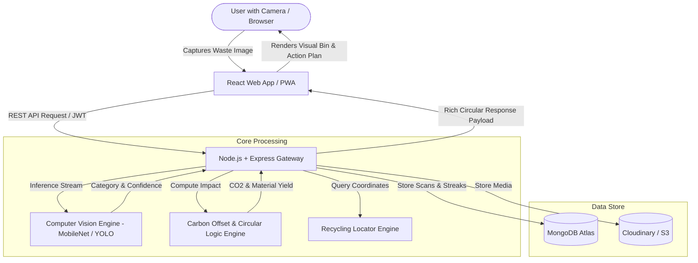

# 🌿 EcoSort AI — Smart Waste Segregation & Circular Economy Intelligence Platform

[](https://opensource.org/licenses/MIT)
[](#)
[](#)
[](#)

> **"Transforming waste identification from simple image recognition into actionable circular material recovery, carbon offsets, and gamified community habits."**

---

## 📌 Quick Links & Documentation

- 📄 **[Software Requirements Specification (SRS v2.0)](./SRS.md)** — Complete IEEE 830 / ISO 29148 compliant system specifications.
- 🔌 **[REST API Specifications](./API_SPECIFICATION.md)** — Full endpoint contracts, JSON payloads, and authentication scheme.
- ♻️ **[Circular Economy Taxonomy](./data/waste_taxonomy.json)** — Master breakdown of 7 waste categories, 28 sub-materials, decomposition timelines, and CO₂ formulas.

---

## 🎯 The Core Innovation: "What Happens Next?"

Traditional waste classification apps only answer **"What is this waste?"** (e.g., *"Plastic Bottle"*).  
**EcoSort AI** transforms this into an **Action-Driven Circular Lifecycle Platform**:

```
                       ┌──────────────────────────────────────────────┐
                       │          1. SCAN & MULTIMODAL AI             │
                       │ Live Camera / Upload -> Instant 97% Detection│
                       └──────────────────────┬───────────────────────┘
                                              │
                       ┌──────────────────────▼───────────────────────┐
                       │      2. EXPLAINABLE REASONING (XAI)          │
                       │ Explains polymer texture, markings, & hazards│
                       └──────────────────────┬───────────────────────┘
                                              │
                       ┌──────────────────────▼───────────────────────┐
                       │    3. "NEXT-LIFE" CIRCULAR ACTION PLAN       │
                       │ Preparation steps, upcycling ideas & bin color│
                       └──────────────────────┬───────────────────────┘
                                              │
                       ┌──────────────────────▼───────────────────────┐
                       │     4. CARBON SAVINGS & PRECIOUS YIELD       │
                       │ CO2 saved, water conserved, gold/copper in e-waste│
                       └──────────────────────┬───────────────────────┘
                                              │
                       ┌──────────────────────▼───────────────────────┐
                       │  5. GAMIFIED INCENTIVES & LOCAL DROP-OFFS    │
                       │ Eco-points, streaks, badges & verified centers│
                       └──────────────────────────────────────────────┘
```

---

## 🌟 Key Features

| Feature | Description | Impact |
| :--- | :--- | :--- |
| 📸 **Instant Multi-Modal Scanner** | Live WebRTC camera stream and image drag-and-drop with instant classification. | Zero friction for domestic and campus users. |
| 🧠 **Explainable AI (XAI)** | Highlights detected materials and explains why items belong in specific streams. | Educates citizens on deceptive multi-layer packaging. |
| 🌍 **Carbon Offset Calculator** | Computes exact grams of CO₂ avoided, water liters conserved, and tree-equivalence. | Makes ecological impact tangible and personal. |
| ⚡ **Urban Mining Yield Estimator** | Quantifies recoverable metals (Gold, Silver, Copper, Cobalt) from discarded electronics. | Shows hidden economic value in e-waste. |
| 🏆 **Gamified Green Challenges** | Eco-Points, streak multipliers, digital NFT-style milestone badges, and school/society leaderboards. | Drives persistent, habit-forming behavioral change. |
| 📍 **Geo-Recycling Center Locator** | Interactive map pinpointing verified e-waste hubs, scrap dealers (kabadiwalas), and compost stations. | Bridges the gap between intent and physical disposal. |
| 📊 **Municipal Analytics Dashboard** | Heatmaps and contamination statistics for urban local bodies and campus sustainability committees. | Enables data-driven civic waste policies. |

---

## 🏗️ System Architecture



---

## 👥 4-Member Team Role Distribution

```
┌───────────────────────────────┬───────────────────────────────┐
│ Member 1 (Frontend & UX Lead) │ Member 2 (Backend & Security) │
│ - React & Tailwind UI Design  │ - Node.js & Express REST APIs │
│ - Live Camera Stream Module   │ - MongoDB & Mongoose Schemas  │
│ - Interactive Dashboards & Map│ - JWT Authentication & RBAC   │
├───────────────────────────────┼───────────────────────────────┤
│ Member 3 (AI & Data Lead)     │ Member 4 (QA, DevOps & Pitch) │
│ - Waste Image Datasets        │ - End-to-End Automated Testing│
│ - Vision Model Training & XAI │ - Cloud Deployment (Vercel/Atlas)│
│ - Circular Action Taxonomy    │ - Slide Pitch Deck & Live Demo│
└───────────────────────────────┴───────────────────────────────┘
```

---

## 🚀 6-Week Execution Roadmap

- **Week 1:** Foundation (HTML/CSS/JS, Design Tokens, Git setup)
- **Week 2:** Dynamic Frontend (React Components, State, Camera WebRTC)
- **Week 3:** Backend & Database (Node/Express APIs, MongoDB Atlas Schemas)
- **Week 4:** AI Vision Integration (TensorFlow/Roboflow Model & Inference)
- **Week 5:** Circular Economy & Gamification (Eco-Points, Streaks, Maps)
- **Week 6:** Testing, Cloud Deployment, and Hackathon Pitch Rehearsal

---

*EcoSort AI — Designed with high architectural rigor for sustainability innovation.*
