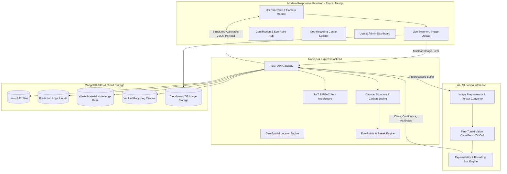
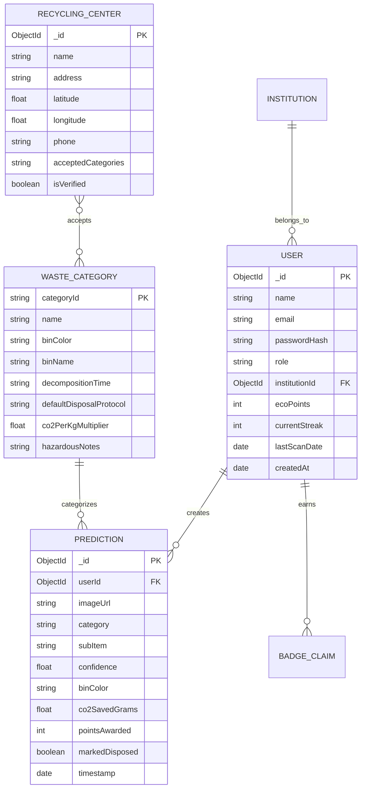
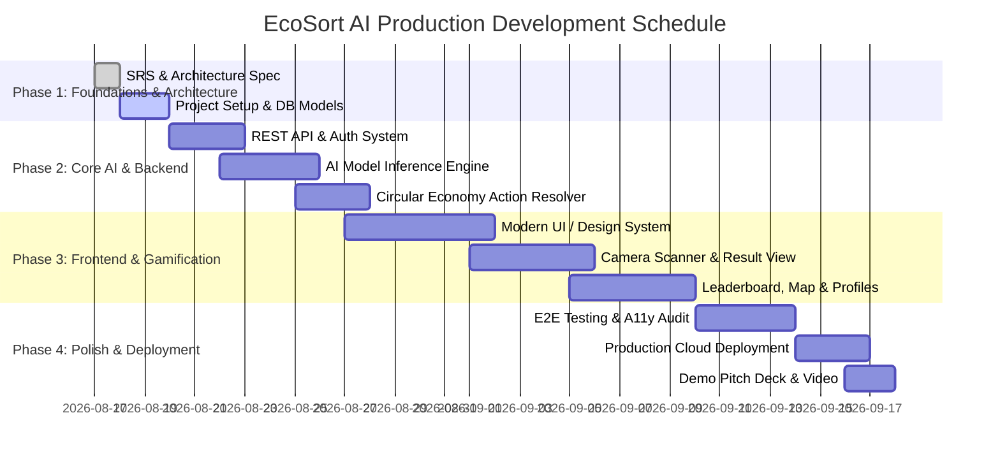

# Software Requirements Specification (SRS)

## EcoSort AI: Smart Waste Segregation & Circular Economy Platform
**Document Version:** 2.0 (Production & Hackathon-Ready Architecture)  
**Standard Compliance:** ISO/IEC/IEEE 29148 & IEEE Std 830-1998  
**Target Tracks:** Sustainability, Smart Cities, AI for Good, Circular Economy  
**Date:** August 2026  
**Status:** Approved for Implementation  

---

## 1. Introduction

### 1.1 Document Purpose
This Software Requirements Specification (SRS) provides a comprehensive, formal definition of the software requirements, architecture, data schemas, functional behaviors, user interfaces, non-functional attributes, and verification criteria for **EcoSort AI**. 

EcoSort AI is an end-to-end smart waste segregation and circular economy intelligence platform designed to shift the user journey from basic image classification to **actionable material recovery, carbon footprint mitigation, and behavioral transformation**.

```
┌─────────────────────────────────────────────────────────────────────────────┐
│                             THE CORE SHIFT                                  │
│                                                                             │
│   Traditional Waste Apps:      "What is this waste?"                        │
│   EcoSort AI Platform:         "What is this waste, WHY is it categorized   │
│                                this way, and WHAT EXACT ACTION must happen  │
│                                next to extract value and prevent harm?"     │
└─────────────────────────────────────────────────────────────────────────────┘
```

### 1.2 Problem Statement
Global municipal solid waste generation is projected to reach 3.4 billion metric tons annually by 2050. The fundamental failure point in modern recycling pipelines is **point-of-disposal contamination**:
1. **Commingled Waste Streams:** High-value recyclables (PET plastics, metals, paper fibers) are contaminated by organic wet waste and hazardous chemicals, rendering entire loads unrecyclable and diverting them to landfills.
2. **Cognitive Burden & Low Awareness:** Citizens struggle with ambiguous multi-material packaging (e.g., plastic-lined paper coffee cups, blister packs, composite electronics).
3. **Lack of Incentives & Accountability:** Conventional waste disposal lacks immediate feedback loops, positive reinforcement, or quantifiable environmental impact metrics.
4. **Information Gap on Circular Pathways:** Users are unaware of local verified e-waste recyclers, scrap buy-back centers, compost pits, or hazardous drop-off sites.

### 1.3 Proposed Solution & System Scope
**EcoSort AI** addresses this systemic breakdown through a multi-tiered intelligent web and mobile-responsive ecosystem:
- **Instant AI Vision Analysis:** Multimodal computer vision classifies waste across 7 major categories (Organic, Plastic, Paper, Metal, Glass, E-Waste, Hazardous) and sub-materials with real-time confidence scores and explainable visual breakdown.
- **"Next-Life" Circular Action Engine:** Recommends precise circular disposition pathways: **Reuse**, **Recycle**, **Compost**, **Repair**, or **Safe Municipal Bin Disposal**.
- **Material Recovery & Toxicity Breakdown:** Quantifies extractable precious materials (e.g., grams of copper/gold in e-waste) and flags toxic risks (e.g., lithium battery fire hazards, lead leaching).
- **Ecological Impact & CO₂ Savings Engine:** Dynamically calculates CO₂ footprint offsets, landfill volume diverted (kg), water conserved (liters), and tree-equivalence metrics per scan.
- **Gamified Behavioral Loop:** Incentivizes proper disposal with **Eco-Points**, streaks, verifiable green badges, and community leaderboards (inter-school, college, and housing society leagues).
- **Municipal Compliance & Geo-Recycling Hub:** Localizes bin color schemes to municipal bylaws and provides an interactive GPS map to verified local scrap buyers and recycling stations.
- **Enterprise & Smart City Analytics:** Admin dashboards aggregate disposal heatmaps, contamination trends, and municipal sustainability reports.

---

## 2. Overall Description

### 2.1 System Architecture Overview



### 2.2 User Classes and Personas

| User Class | Description | Primary Needs |
| :--- | :--- | :--- |
| **Citizen / Household User** | General public disposing of domestic packaging, food scraps, and daily consumer goods. | Instant camera scan, clear color-coded bin guidance, decomposition countdown, effortless disposal advice. |
| **Student / Eco-Champion** | School or university students competing in green campus challenges. | Eco-points, daily streaks, leaderboards, interactive carbon savings stats, shareable achievement badges. |
| **Community / Society Manager** | Leads of residential societies, dorms, or corporate green committees. | Society-wide waste metrics, collective diversion goals, contamination alerts. |
| **Municipal / Admin Authority** | Urban local body (ULB) waste managers, recycling coordinators, and system operators. | City-wide disposal heatmaps, common misclassification trends, center management, audit reports. |

### 2.3 Operating Environment & Constraints

| Parameter | Specification |
| :--- | :--- |
| **Supported Client Platforms** | Modern Web Browsers (Chrome 100+, Safari 15+, Firefox 100+, Edge 100+), PWA Mobile-optimized. |
| **Client Camera API** | WebRTC `navigator.mediaDevices.getUserMedia` for real-time video stream & snapshot capture. |
| **Backend Runtime** | Node.js v18 LTS / v20 LTS with Express.js. |
| **Database Engine** | MongoDB Atlas v6.0+ (Mongoose ODM). |
| **AI Inference Runtime** | TensorFlow.js (Edge/Browser fallback) / Python FastAPI / Hugging Face Inference Endpoint / ONNX Runtime. |
| **Network Constraints** | Full operations on 3G/4G/5G and Broadband; offline caching for basic guide lookup via PWA Service Workers. |

---

## 3. Waste Taxonomy & Circular Action Matrix

EcoSort AI categorizes all physical waste into **7 Primary Master Streams** and **28 Sub-Categories**, mapped to specific circular economy pathways:

```
                               ┌─────────────────────────────┐
                               │     7 MASTER CATEGORIES     │
                               └──────────────┬──────────────┘
      ┌───────────┬───────────┬───────────────┼───────────────┬───────────┬───────────┐
      │           │           │               │               │           │           │
  ┌───▼───┐   ┌───▼───┐   ┌───▼───┐       ┌───▼───┐       ┌───▼───┐   ┌───▼───┐   ┌───▼───┐
  │ORGANIC│   │PLASTIC│   │ PAPER │       │ METAL │       │ GLASS │   │E-WASTE│   │HAZARD │
  └───────┘   └───────┘   └───────┘       └───────┘       └───────┘   └───────┘   └───────┘
```

### 3.1 Material & Circular Disposal Matrix

| Category | Typical Items | Municipal Bin | Decomp. Time | Circular Action | Recoverable Value / Danger |
| :--- | :--- | :--- | :--- | :--- | :--- |
| **1. Organic** | Food waste, peels, garden clippings, tea bags, eggshells | **Green Bin** (Wet Waste) | 2 to 6 Weeks | **Composting / Bio-Methanation:** Convert to organic soil humus or biogas. | High nitrogen/carbon nutrient value. Avoid plastic contamination. |
| **2. Plastic** | PET bottles (Type 1), HDPE milk jugs (Type 2), LDPE bags (Type 4), PP food containers (Type 5) | **Blue Bin** (Dry Recyclable) | 100 to 500 Years | **Mechanical / Chemical Recycling:** Wash, shred, pelletize into recycled polymer flakes. | Conserves crude oil; high recyclability if clean and unmixed. |
| **3. Paper** | Office paper, cardboard boxes, newspapers, magazines | **Blue Bin** (Dry Recyclable) | 2 to 6 Months | **Pulp Reprocessing:** Convert to recycled carton board, egg trays, kraft paper. | Saves ~17 trees per metric ton of virgin paper replaced. |
| **4. Metal** | Aluminum soda cans, tin cans, foil trays, scrap metal parts | **Blue Bin** (Dry Recyclable) | 50 to 200 Years | **Smelting & Remelting:** Indefinitely recyclable without degradation. | Aluminum recycling saves 95% of the energy needed for raw bauxite extraction. |
| **5. Glass** | Clear/colored beverage bottles, glass jars, food containers | **Blue Bin** (Dry Glass) | 1 Million+ Years | **Cullet Melting:** 100% infinitely recyclable at lower furnace temperatures. | Completely non-toxic, closed-loop material. |
| **6. E-Waste** | Old smartphones, circuit boards, cables, chargers, monitors | **Yellow / Designated Drop-off** | Non-biodegradable | **Certified Urban Mining & Dismantling:** Extract precious metals; safely neutralize cadmium/lead. | Contains Gold, Silver, Copper, Rare Earth Elements; hazardous if burnt. |
| **7. Hazardous** | Batteries, paint cans, tube lights, expired medicines, pesticide bottles, aerosol cans | **Red Bin / Hazardous Drop-off** | Persistent Contaminant | **Specialized Thermal/Chemical Neutralization:** Prevent toxic groundwater leaching. | Leaches Lead, Mercury, Acid; risk of chemical fires in standard dumpsters. |

---

## 4. Functional Requirements (FR)

### Module 1: Authentication & User Profiles (FR-AUTH)

#### `FR-AUTH-01`: Multi-Tier Registration & Login
- **Description:** System allows users to register with Name, Email, Password, Role (`citizen`, `institution_member`, `admin`), and optional Community/Institution affiliation (e.g., "Greenfield High School").
- **Inputs:** `name` (string), `email` (valid email), `password` (min 8 chars, 1 number, 1 special char), `institution` (optional string).
- **Processing:**
  1. Validate email format and uniqueness in Database.
  2. Hash password with `bcrypt` (minimum 10 salt rounds).
  3. Generate JSON Web Token (JWT) with 7-day expiration.
- **Outputs:** JWT token, sanitized User profile object (excluding password hash).

#### `FR-AUTH-02`: Profile & Eco-Identity Management
- **Description:** Users can view personal ecological metrics: Total Scans, Total CO₂ Saved (kg), Current Eco-Point Balance, Active Streak Days, and Earned Badges.
- **Inputs:** Bearer JWT Token, profile update payload.
- **Outputs:** Detailed user statistics and badge repository.

---

### Module 2: Multimodal Waste Capture & Ingestion (FR-INGEST)

#### `FR-INGEST-01`: Image Upload via Drag-and-Drop & File Picker
- **Description:** Accepts user-supplied image files from local disk storage.
- **Validation Rules:**
  - Allowed MIME types: `image/jpeg`, `image/png`, `image/webp`, `image/heic`.
  - Max file size: 10 MB (client-side compressed before upload to max 1280px resolution).
  - Validation error handling for non-image or corrupted files.

#### `FR-INGEST-02`: Live WebRTC Camera Capture Stream
- **Description:** Enables instant, in-browser camera streaming with viewfinder targeting reticle and instant single-click shutter capture.
- **Processing:** Captures canvas frame from the active video stream, converts to Blob/File, and transmits to prediction endpoint.

---

### Module 3: Intelligent AI Classification & Explainability (FR-AI)

#### `FR-AI-01`: Multi-Class Waste Classification
- **Description:** Processes the input image through the fine-tuned vision classification model and outputs:
  - Primary Category (e.g., `Plastic`).
  - Item Identification (e.g., `PET Beverage Bottle`).
  - Top-1 Confidence Score (e.g., `96.8%`).
  - Top-3 Ranked Probabilities with distribution percentages.

#### `FR-AI-02`: Explainable AI (XAI) & Visual Rationale
- **Description:** Explains *why* the AI placed the object into this category (e.g., *"Detected translucent polyethylene terephthalate polymer texture, screw thread neck, and standard PET-1 recycling triangular icon"*).
- **Processing:** Generates structured visual reasoning tags (`Material Composition`, `Contamination State`, `Recyclability Indicator`).

---

### Module 4: "Next-Life" Circular Action Engine (FR-ACTION)

#### `FR-ACTION-01`: Step-by-Step Preparation Protocol
- **Description:** Displays exact physical steps required prior to discarding.
- **Example for Plastic Bottle:**
  1. *Empty & Rinse:* Pour out remaining liquids to prevent mold and weight corruption.
  2. *Crush:* Flatten the bottle to save bin and transport volume.
  3. *Cap Instruction:* Keep cap screwed on or separate per local municipal guideline.
  4. *Bin Assignment:* Deposit into **Blue Dry Recyclables Bin**.

#### `FR-ACTION-02`: Decomposition Countdown & Ecological Impact
- **Description:** Calculates and visualizes:
  - **Estimated Decomposition Duration:** Illustrated on a comparative time horizon (e.g., *"Takes 450 years to break down in a standard landfill"*).
  - **CO₂ Offset Calculation:** Grams/kilograms of carbon emissions prevented when recycled vs virgin manufacturing.
  - **Recoverable Material Estimation:** For e-waste and metals, estimates yield (e.g., ~0.03g gold, 16g copper from a batch of smartphones).

---

### Module 5: Gamification, Eco-Points & Streaks (FR-GAME)

#### `FR-GAME-01`: Eco-Point Awarding & Streak Multiplier
- **Description:** Upon completing a verified scan and clicking **"Mark as Disposed Correctly"**, the system:
  1. Awards base points:
     - Organic: +10 Points
     - Paper / Plastic / Glass / Metal: +15 Points
     - E-Waste / Hazardous (Drop-off logged): +30 Points
  2. Evaluates active streak: If the user scanned yesterday or today, increments streak counter. Streaks ≥ 7 days award a 1.25x point multiplier.

#### `FR-GAME-02`: Dynamic Eco-Badges
- **Milestone Badges:**
  - *🌱 Seedling Sorter:* First scan completed.
  - *♻️ Master Recycler:* 25 recyclable items logged.
  - *⚡ Urban Miner:* First E-waste drop-off verified.
  - *🔥 Century Streak:* 30-day consecutive scan streak.
  - *🌍 Carbon Neutralizer:* 10.0 kg of CO₂ offset achieved.

#### `FR-GAME-03`: Competitive Leaderboards
- **Description:** Ranks users globally, weekly, and by institution/housing society.
- **Filters:** All-Time, Monthly, Weekly, Campus/Society specific.

---

### Module 6: Geo-Recycling & Drop-off Locator (FR-GEO)

#### `FR-GEO-01`: Interactive Map of Verified Recycling Centers
- **Description:** Uses OpenStreetMap / Leaflet or Google Maps to render nearby:
  - Authorized E-Waste Collection Centers
  - Scrap Metal & Paper Buy-Back Merchants (Kabadiwalas)
  - Municipal Composting & Drop-off Centers
  - Glass & Plastic Reprocessors
- **Details Displayed:** Facility Name, Address, Accepted Waste Streams, Contact Number, Distance (km), and Directions button.

---

### Module 7: Historical Audit Log & Personal Analytics (FR-HIST)

#### `FR-HIST-01`: Personal Waste Logbook
- **Description:** Displays chronological history of user scans with thumbnail, category badge, timestamp, confidence score, points earned, and deletion capability.

#### `FR-HIST-02`: Aggregated Personal Analytics
- **Visuals:**
  - Category breakdown donut chart (e.g., 42% Plastic, 28% Organic, 15% Paper, 10% Metal, 5% E-waste).
  - Monthly disposal trends line chart.
  - Cumulative CO₂ and landfill volume gauge meters.

---

### Module 8: Municipal & Admin Analytics Command Center (FR-ADMIN)

#### `FR-ADMIN-01`: System-Wide Metric Aggregates
- **Metrics:** Total Registered Citizens, Total Items Classified, Overall Model Accuracy/Feedback Score, Gross Tonnage Diverted from Landfills, Aggregate CO₂ Saved (MT).

#### `FR-ADMIN-02`: City/Region Contamination & Heatmap Analysis
- **Description:** Visualizes which zones/pincodes generate the highest misclassification or hazardous waste risks.

---

## 5. Non-Functional Requirements (NFR)

### 5.1 Performance & Latency Requirements
- **`NFR-PERF-01` API Latency:** Classification inference and complete circular payload response must resolve within **< 2.5 seconds** on standard 4G mobile connections.
- **`NFR-PERF-02` Image Preprocessing:** Client-side image canvas resizing must complete in **< 150 milliseconds**.
- **`NFR-PERF-03` Web Performance:** Lighthouse score target: **≥ 90** across Performance, Accessibility, Best Practices, and SEO.

### 5.2 Security & Data Privacy
- **`NFR-SEC-01` Authentication:** Stateless JWT stored securely in `HttpOnly` cookies or local storage with standard Bearer authorization headers.
- **`NFR-SEC-02` Password Encryption:** Passwords hashed with `bcryptjs` using salt factor `10`.
- **`NFR-SEC-03` Data Minimization:** Image uploads can be retained as anonymized prediction samples or deleted on user request (GDPR/CCPA privacy compliant).
- **`NFR-SEC-04` Input Sanitization:** Protection against NoSQL injection, XSS (`helmet`, `express-validator`), and CORS restriction.

### 5.3 Scalability & Reliability
- **`NFR-SCAL-01` Concurrency:** Backend architecture designed to handle **1,000+ simultaneous requests** via asynchronous Node event loop.
- **`NFR-REL-01` Availability:** Target 99.9% uptime with graceful degradation (client-side pre-cached fallback model if backend offline).

### 5.4 Usability & Accessibility
- **`NFR-UI-01` Mobile-First Responsive Design:** Seamless layout adaptation from 320px smartphones to 4K ultra-wide monitors.
- **`NFR-UI-02` Accessibility:** Compliance with **WCAG 2.1 Level AA** (color contrast ratios ≥ 4.5:1, screen reader ARIA labels on all icons and bins).

---

## 6. Database Schema & Data Models

### 6.1 Mongoose Entity-Relationship Overview



### 6.2 JSON Document Schemas

#### 1. User Schema (`models/User.js`)
```json
{
  "_id": "66c1f01a8f1b2c0012345678",
  "name": "Aarav Sharma",
  "email": "aarav.eco@example.com",
  "password": "$2a$10$e8T7V...hashed...",
  "role": "citizen",
  "institution": "Delhi Technological University",
  "ecoPoints": 485,
  "currentStreak": 6,
  "longestStreak": 14,
  "lastScanDate": "2026-08-17T10:15:30.000Z",
  "stats": {
    "totalScans": 34,
    "totalCo2SavedKg": 4.82,
    "totalPlasticDivertedKg": 1.95,
    "totalOrganicCompostedKg": 5.40
  },
  "badges": [
    { "badgeId": "seedling_sorter", "unlockedAt": "2026-08-01T09:00:00Z" },
    { "badgeId": "master_recycler", "unlockedAt": "2026-08-14T14:30:00Z" }
  ],
  "createdAt": "2026-08-01T08:30:00.000Z"
}
```

#### 2. Prediction Schema (`models/Prediction.js`)
```json
{
  "_id": "66c1f23b8f1b2c0087654321",
  "userId": "66c1f01a8f1b2c0012345678",
  "imageUrl": "https://res.cloudinary.com/ecosort/image/upload/v1/samples/bottle.jpg",
  "category": "Plastic",
  "subItem": "PET Mineral Water Bottle (Type 1)",
  "confidence": 0.974,
  "binInfo": {
    "binColor": "Blue",
    "binName": "Dry Recyclable Waste",
    "icon": "recycle"
  },
  "circularAction": {
    "actionType": "Recycle",
    "prepSteps": [
      "Empty remaining liquid completely",
      "Crush the bottle body to save transport volume",
      "Keep cap on or follow local PET recycling collection"
    ],
    "decompositionTimeline": "450 Years",
    "recyclable": true,
    "upcyclingIdea": "Cut in half to create a self-watering micro seedling planter."
  },
  "environmentalImpact": {
    "co2SavedGrams": 82.5,
    "waterSavedLiters": 1.2,
    "energySavedWattHours": 45.0
  },
  "pointsAwarded": 15,
  "markedDisposed": true,
  "timestamp": "2026-08-17T10:15:30.000Z"
}
```

---

## 7. REST API Specifications

### 7.1 Authentication & User Endpoints

| Method | Endpoint | Description | Auth Required |
| :--- | :--- | :--- | :--- |
| `POST` | `/api/auth/register` | Register new account with role and affiliation | No |
| `POST` | `/api/auth/login` | Authenticate user and return JWT + Profile | No |
| `GET` | `/api/auth/me` | Fetch currently authenticated user profile & metrics | Yes (Bearer JWT) |
| `PUT` | `/api/auth/profile` | Update profile details and institution | Yes (Bearer JWT) |

### 7.2 AI Classification & Prediction Endpoints

| Method | Endpoint | Description | Auth Required |
| :--- | :--- | :--- | :--- |
| `POST` | `/api/predict` | Upload image (multipart/form-data) or Base64, classify waste, return full circular plan | Optional (Guest/User) |
| `POST` | `/api/predict/confirm-disposal` | Confirm proper disposal of prediction item, trigger points & streak increase | Yes (Bearer JWT) |
| `GET` | `/api/predict/history` | Retrieve paginated prediction history for current user | Yes (Bearer JWT) |
| `DELETE` | `/api/predict/history/:id` | Remove a prediction record from user history | Yes (Bearer JWT) |

#### Example: `POST /api/predict`
**Request (Multipart Form or JSON):**
```json
{
  "image": "data:image/jpeg;base64,/9j/4AAQSkZJRgABAQAAAQ...",
  "latitude": 28.6139,
  "longitude": 77.2090
}
```

**Response (`200 OK`):**
```json
{
  "success": true,
  "data": {
    "predictionId": "66c1f23b8f1b2c0087654321",
    "category": "E-Waste",
    "subItem": "Lithium-Ion Smartphone / Portable Circuit",
    "confidence": 0.948,
    "probabilities": [
      { "category": "E-Waste", "score": 0.948 },
      { "category": "Metal", "score": 0.038 },
      { "category": "Plastic", "score": 0.014 }
    ],
    "explainability": {
      "rationale": "Detected lithium polymer battery casing, micro USB connector, and printed circuit assembly.",
      "hazardLevel": "Moderate to High if punctured or incinerated"
    },
    "binGuidance": {
      "binColor": "Yellow",
      "binName": "Authorized E-Waste Collection Bin",
      "doNotMixWith": ["General Municipal Trash", "Wet Organic Waste"]
    },
    "circularAction": {
      "recommendedPathway": "Certified E-Waste Drop-Off & Urban Mining",
      "recoverableMaterials": [
        { "material": "Copper", "estimatedAmount": "14 grams" },
        { "material": "Cobalt", "estimatedAmount": "8 grams" },
        { "material": "Gold/Silver Traces", "estimatedAmount": "0.02 grams" }
      ],
      "decompositionTime": "Non-Biodegradable (Toxic persistence > 1,000 years)",
      "prepSteps": [
        "Do not puncture or crush the battery",
        "Backup and perform factory reset if powering on",
        "Take to nearest certified e-waste deposit center"
      ]
    },
    "environmentalImpact": {
      "co2OffsetKg": 2.4,
      "toxicLeachatePrevented": "Heavy metals prevented from ground water contamination"
    },
    "ecoPointsEligible": 30
  }
}
```

### 7.3 Community, Centers & Leaderboard Endpoints

| Method | Endpoint | Description | Auth Required |
| :--- | :--- | :--- | :--- |
| `GET` | `/api/community/leaderboard` | Get ranked leaderboard (all-time, weekly, institution) | No |
| `GET` | `/api/centers/nearby` | Query recycling centers by geo-coordinates (`?lat=...&lng=...&radius=10`) | No |
| `GET` | `/api/waste-catalog` | Get complete reference catalog for all 7 waste categories | No |
| `GET` | `/api/admin/metrics` | Retrieve city/platform aggregate sustainability metrics | Admin Only |

---

## 8. User Interface & Experience Specification

### 8.1 Design System Tokens
- **Design Philosophy:** Modern, clean, eco-futuristic glassmorphism with high visual polish, vibrant yet harmonious palettes, micro-animations, and instant feedback.
- **Color Palette:**
  - `Brand Primary (Emerald Green)`: `#10B981` (Vibrant Eco Action)
  - `Brand Secondary (Forest Dark)`: `#064E3B` / `#022C22`
  - `Surface Dark (Dark Mode Base)`: `#0F172A` / `#1E293B`
  - `Organic (Wet Waste)`: `#22C55E` (Emerald Green)
  - `Plastic & Recyclables`: `#3B82F6` (Electric Cyan/Blue)
  - `Paper`: `#F59E0B` (Warm Amber/Kraft)
  - `Metal`: `#8B5CF6` (Bright Silver/Violet)
  - `Glass`: `#06B6D4` (Teal Glass)
  - `E-Waste`: `#EC4899` / `#F97316` (Neon Orange/Pink)
  - `Hazardous`: `#EF4444` (Crimson Alert)
- **Typography:** Google Font **'Plus Jakarta Sans'** or **'Outfit'** paired with **'Inter'** for crisp, modern reading ergonomics.

### 8.2 Primary Screen Flows

```
┌─────────────────┐      ┌─────────────────┐      ┌─────────────────────────┐
│   HOME / HERO   │ ---> │  SCANNER HUB    │ ---> │   PREDICTION RESULT     │
│                 │      │  (Camera/Drop)  │      │   - Category & Confidence│
│ - Interactive   │      └─────────────────┘      │   - Color Bin Guideline │
│   Hero Visual   │                               │   - Circular Action Plan│
│ - Stats counter │                               │   - Carbon Offsets      │
│ - Quick Scan CTA│                               │   - "Mark Disposed" CTA │
└─────────────────┘                               └────────────┬────────────┘
         │                                                     │
         ▼                                                     ▼
┌─────────────────┐      ┌─────────────────┐      ┌─────────────────────────┐
│ RECYCLING MAP   │      │   LEADERBOARD   │      │     USER PROFILE        │
│ Nearby verified │      │ Campus & Global │      │ - Badges & Streaks      │
│ drop-off hubs   │      │ green champions │      │ - Carbon Saved Meters   │
└─────────────────┘      └─────────────────┘      │ - Personal Audit Logs   │
                                                  └─────────────────────────┘
```

---

## 9. AI Computer Vision Pipeline & Model Architecture

```
┌────────────────┐     ┌────────────────┐     ┌────────────────┐     ┌────────────────┐
│ Input Waste    │     │ Preprocessing  │     │ Deep Feature   │     │ Output Layer   │
│ Image (Photo)  │ ──> │ 224x224 RGB    │ ──> │ Extraction     │ ──> │ Softmax Prob.  │
│                │     │ Normalize [-1,1│     │ MobileNetV3 /  │     │ 7-Class Vector │
│                │     │ Data Augment.  │     │ YOLOv8-cls     │     │ + Confidence   │
└────────────────┘     └────────────────┘     └────────────────┘     └────────────────┘
```

### 9.1 Model Strategy
1. **Primary Model:** Fine-Tuned Convolutional Neural Network (Transfer Learning with **MobileNetV3-Large** or **EfficientNet-B0** / **YOLOv8-Classify**) trained on Kaggle Waste Classification Datasets (25,000+ labeled images across Organic, Plastic, Paper, Metal, Glass, E-Waste, and Hazardous).
2. **Edge Fallback via TensorFlow.js:** Quantized WebGL/WebAssembly model bundle (~4.2 MB) allowing client-side zero-latency offline inference when network connectivity is lost.
3. **Inference Post-Processing:**
   - Softmax normalization.
   - Ambiguity detection: If top confidence is $< 60\%$, prompts user: *"Image uncertain. Is this packaging mixed? Check our guide or retake photo with better lighting."*

---

## 10. Project Implementation Roadmap & Hackathon Milestones



---

## 11. Verification, Testing & Acceptance Matrix

| Test ID | Requirement | Test Scenario & Verification Step | Expected Result |
| :--- | :--- | :--- | :--- |
| **`TC-01`** | `FR-AUTH-01` | Register user with valid email and strong password. | User created in DB; returns HTTP 201 with JWT token. |
| **`TC-02`** | `FR-INGEST-01` | Upload an invalid 15MB `.exe` or corrupted binary. | Rejected immediately on client/server with descriptive 400 error. |
| **`TC-03`** | `FR-AI-01` | Supply high-resolution photo of PET water bottle. | Classified as **Plastic (PET)** with confidence $\ge 90\%$, bin mapped to **Blue**. |
| **`TC-04`** | `FR-ACTION-01` | Scan banana peel (Organic). | Returns **Green Bin**, decomposition timeline 2-4 weeks, composting advice, +10 points. |
| **`TC-05`** | `FR-ACTION-02` | Scan old iPhone motherboard (E-Waste). | Displays precious metal yield (Copper/Gold), hazard alert, nearest drop-off center. |
| **`TC-06`** | `FR-GAME-01` | Click "Confirm Proper Disposal" for a valid scan. | User Eco-Points increase, streak increments, audit log entry saved in history. |
| **`TC-07`** | `NFR-PERF-01` | Measure total round-trip latency for `/api/predict`. | Entire transaction completes in $< 2.5\text{s}$ under standard network. |

---

## 12. Conclusion & Next Steps

This Software Requirements Specification establishes the exact blueprint for building **EcoSort AI** as a market-ready, judge-differentiating sustainability platform. 

### Ready to Execute:
1. **Backend & Database Initialization:** Scaffold Express.js REST API with Mongoose schemas for Users, Predictions, Categories, and Centers.
2. **AI Inference Pipeline:** Implement computer vision classifier with circular economy metadata mapping.
3. **High-Aesthetic Frontend:** Implement modern, dynamic UI with live camera capture, glassmorphism dashboard, interactive recycling maps, and gamification mechanics.
